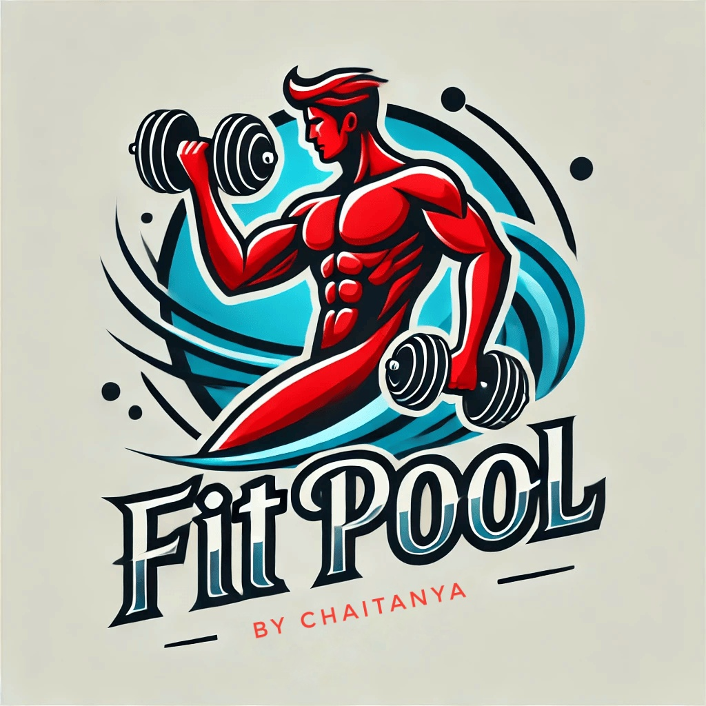

<div align="center">
  
  <h1>🏊‍♀️ Fit Pool</h1>
  <p><i>Your personal fitness companion – Search, Track, and Transform.</i></p>
  
  <a href="https://fitpool.netlify.app/" target="_blank">
    
  </a>
  
  
  
</div>

---

## 🚀 Project Overview

**Fit Pool** is a sleek, modern, and fully responsive **fitness web application** built to support users in their fitness journey. Whether you're a beginner or a regular at the gym, this app gives you tools to search for exercises, calculate your BMI, and track your sets with a stopwatch.

> 💡 “Lost in your fitness journey? Fit Pool helps you find your way.”

---

## ✨ Features

- 🔍 **Exercise Search**: Search exercises by body part, name, or equipment using real-time data from the **ExerciseDB API**.
- 🧮 **BMI Calculator**: Input your height and weight to calculate your Body Mass Index and know where you stand.
- ⏱️ **Workout Stopwatch**: Simple start/pause/reset stopwatch to time your sets and breaks.
- 🎨 **Responsive UI**: Clean, attractive layout that works on both desktop and mobile.
- 🔐 **Firebase Authentication**: User sign-up and login with Google Firebase for secure access.

---

## 🛠️ Tech Stack

| Category         | Technology                                |
|------------------|--------------------------------------------|
| 🚀 Frontend      | Vite + React                               |
| 🎨 Styling       | Tailwind CSS, Material UI, CSS Modules     |
| 🔀 Animation     | Framer Motion                              |
| 🔐 Auth          | Firebase Authentication                    |
| 📡 API           | ExerciseDB API                             |
| 🧪 State Mgmt    | React Hooks                                |
| 🌍 Deployment    | Netlify [`fitpool.netlify.app`](https://fitpool.netlify.app/) |

---

## 📦 Installation

Follow the steps below to set up **Fit Pool** on your local machine:

```bash
# 1. Clone the repository
git clone https://github.com/PanjaChaitanya/Fit-Pool.git
cd Fit-Pool

# 2. Install dependencies
npm install

# 3. Create environment file
touch .env.local
````

Add the following variables to `.env.local`:

```env
VITE_FIREBASE_API_KEY=your_firebase_api_key
VITE_FIREBASE_AUTH_DOMAIN=your_auth_domain
VITE_FIREBASE_PROJECT_ID=your_project_id
VITE_EXERCISEDB_API_KEY=your_exercisedb_api_key
```

```bash
# 4. Start development server
npm run dev
```

App should now be running on: [http://localhost:5173](http://localhost:5173)

---

## 🧭 Usage Guide

### 🔐 Authentication

* Sign up or log in via Firebase (email/password or Google).

### 🔍 Exercise Search

* Use filters or search bar to explore exercises.
* Get details like targeted muscle, equipment, and demo GIFs.

### 🧮 BMI Calculator

* Enter your height and weight.
* Instantly see your BMI score and health category.

### ⏱ Stopwatch

* Time your workouts with a start/pause/reset stopwatch.
* Perfect for HIIT, cardio, or rest intervals.

---

## 🖼 Screenshots

| Search Exercises                           | BMI Calculator                         | Stopwatch                               |
| ------------------------------------------ | -------------------------------------- | --------------------------------------- |
|  |  |  |

> 💡 All screenshots are located in the `screenshots/` folder.

---

## 🤝 Contributing

Contributions are welcome! 🫶

1. Fork the repo
2. Create a new branch (`git checkout -b feature/YourFeature`)
3. Commit your changes (`git commit -m 'Add your message'`)
4. Push to the branch (`git push origin feature/YourFeature`)
5. Open a Pull Request

> Follow existing code style and file structure. For large features, please open an issue first.

---

## 📄 License

This project currently does not have an official license. Please contact the repository owner for reuse or contribution rights.

---

## 🌐 Live Demo

🔗 [https://fitpool.netlify.app](https://fitpool.netlify.app)

Go ahead and give it a try! Your fitness journey just got easier. 💪

---

## 💬 Connect with Me

* 🔗 [LinkedIn](https://www.linkedin.com/in/chaitanyapanja/)
* 💻 [GitHub](https://github.com/PanjaChaitanya)
* 🌐 [Portfolio](https://chaitanyapanja.vercel.app)

---

> “The body achieves what the mind believes.” – Train smart with **Fit Pool** 🏋️‍♀️

```

---
